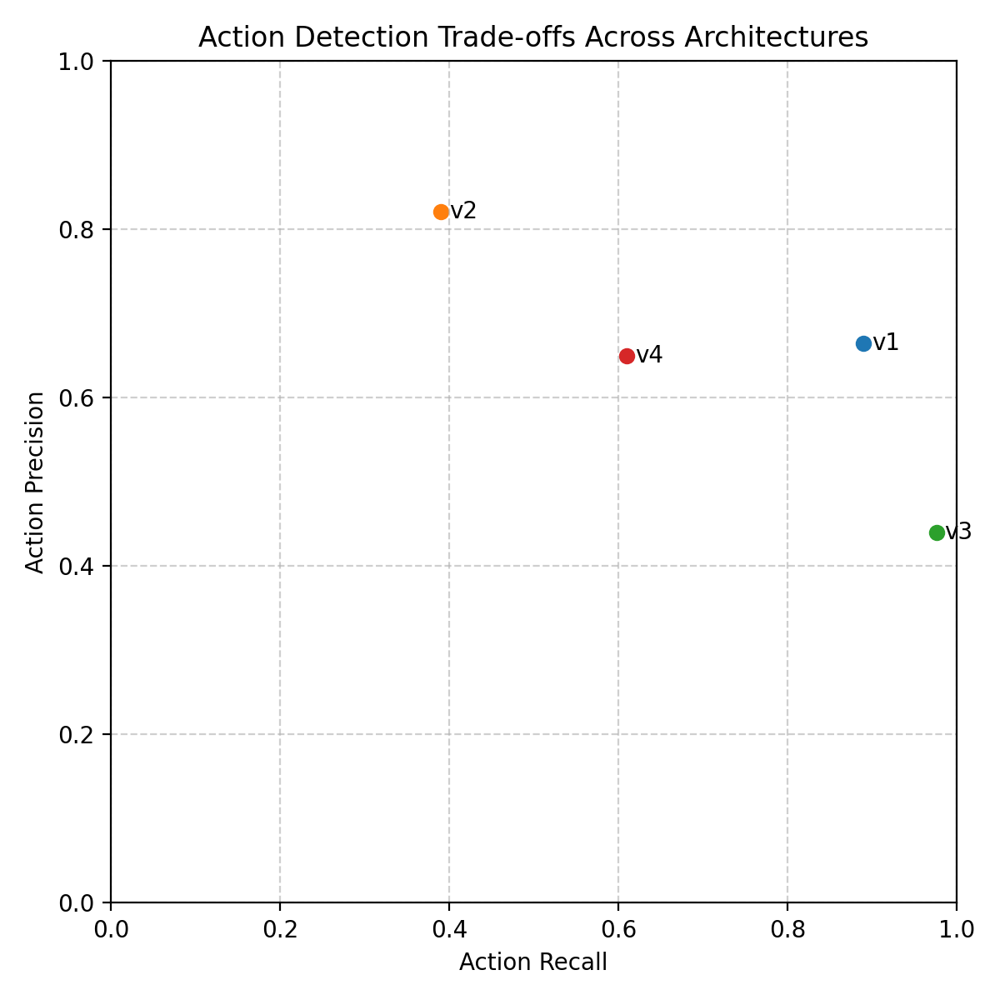
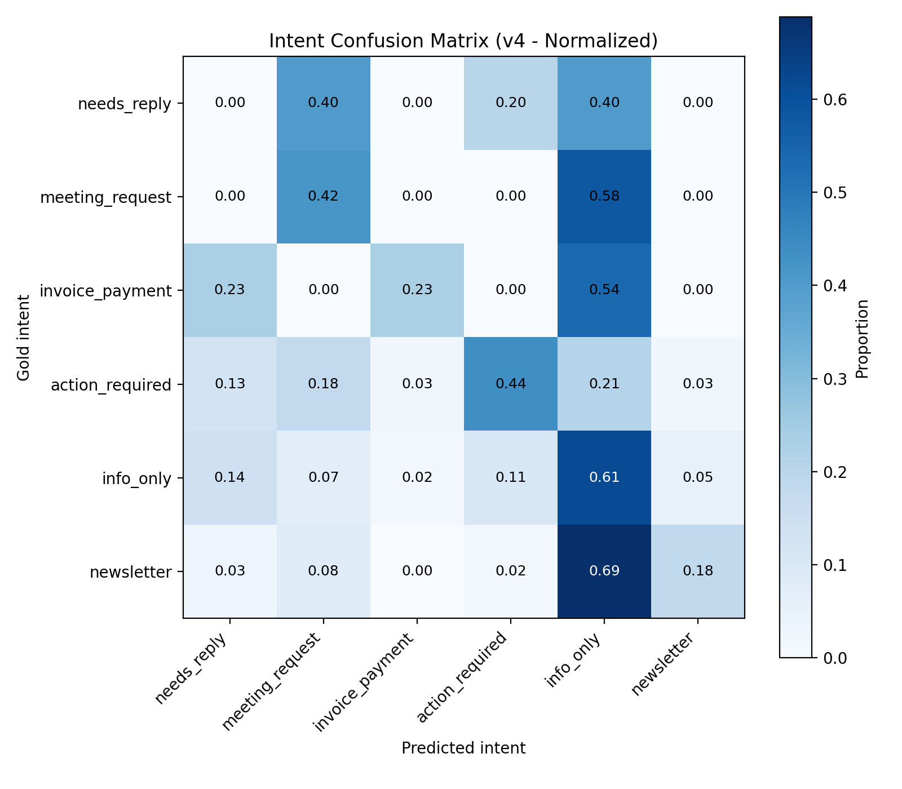
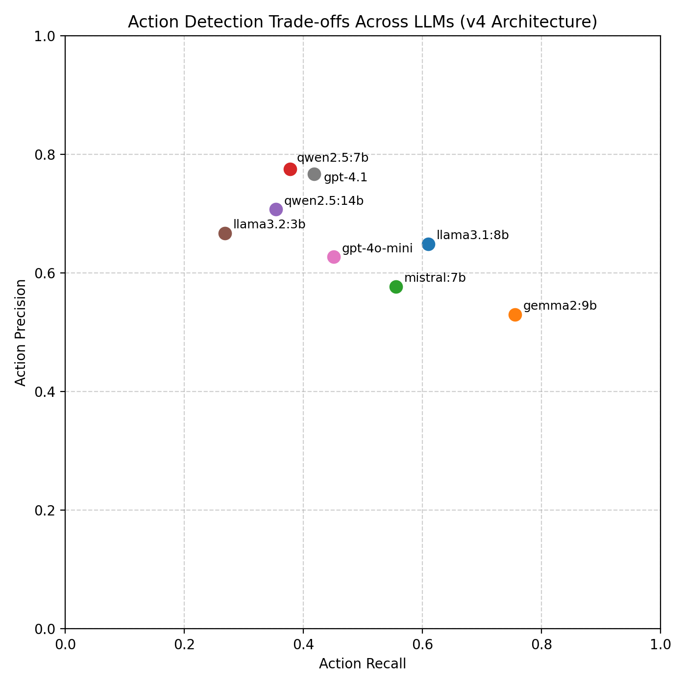
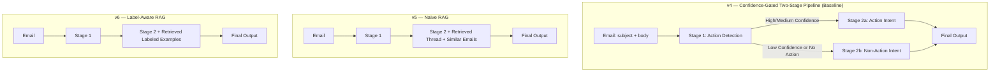
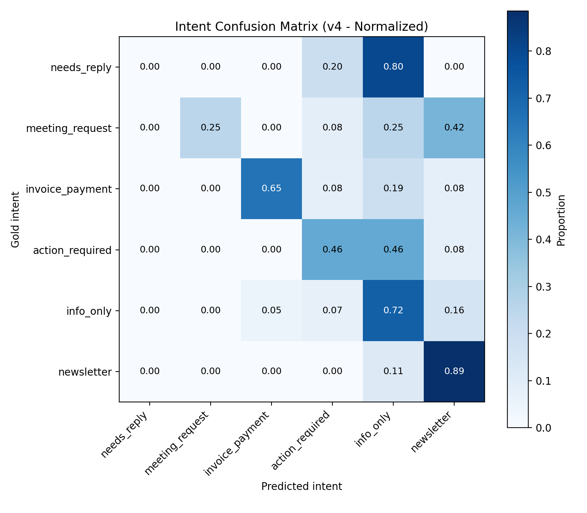

# LLM Inbox Action Copilot (Local-First)

A local-first LLM system for **email triage and action detection**, built to explore how architectural design, retrieval, and supervised learning compare to prompt-only LLM approaches in real inbox workflows.

The project focuses on these:

- Detecting whether an email requires action
- Classifying the type of action
- Understanding when prompt engineering stops helping
- Comparing LLM pipelines against supervised embedding-based models

---

## Motivation

Modern inboxes mix:

- newsletters and promotions
- confirmations and notifications
- invoices and payments
- meeting requests
- genuine action requests

Rule-based filters are brittle, while end-to-end LLM solutions often hide failure modes behind impressive outputs.

This project was built to answer a more practical question:

> _For structured inbox triage, what matters more: model size, prompt design, retrieval, or supervised learning?_

---

## Key Features

- Local-first architecture (Ollama for LLM inference)
- Cloud benchmarking via OpenAI API (GPT-4o-mini, GPT-4.1)
- Real personal email data exported from Thunderbird (.eml)
- Robust preprocessing (HTML cleaning + reply stripping)
- Weak → gold labeling workflow with custom Streamlit UI
- RAG integration (retrieval over historical emails and labelled examples)
- Supervised embedding-based classifier (5-fold OOF evaluation)
- Transparent evaluation (accuracy, precision/recall, confusion matrices)

No emails are sent, modified, or uploaded anywhere.

---

## High-Level Pipeline

1. **Email ingestion**
   - Parse .eml files
   - Extract headers, subject, sender
   - Clean HTML and isolate latest message body

2. **Weak labeling**
   - Heuristic rules generate approximate intent and action labels
   - Used only for bootstrapping and sampling

3. **Gold labeling**
   - Manual labeling of a representative subset via Streamlit
   - Focused on _user workflow_, not surface keywords

4. **Modeling approaches**
   - LLM pipelines (v1–v4)
     - Single-stage → staged → confidence-gated routing
   - RAG extensions (v5–v6)
     - Retrieval over historical emails and labelled examples
   - Supervised baseline (v7)
     - Sentence-transformer embeddings + logistic regression
     - Evaluated with 5-fold out-of-fold cross-validation

5. **Evaluation & comparison**
   - Structured evaluation scripts
   - Confusion matrices
   - Precision–recall trade-off analysis
   - Cross-model benchmarking (local vs OpenAI models)

---

## Label Definitions

### Action Presence

- **True**: the user must do _something_ (reply, schedule, pay, verify, submit, reset, approve)
- **False**: purely informational or ignorable

### Intent Classes

- `meeting_request` – scheduling or availability required
- `invoice_payment` – billing, invoices, payments
- `action_required` – task beyond replying (reset password, submit form, verify account)
- `needs_reply` – a reply completes the task
- `info_only` – confirmations or notifications with no action
- `newsletter` – bulk promotional or broadcast content

---

## Architectural Evolution

### v1–v4: Prompt-Based LLM Pipelines

- Single-stage → two-stage → confidence-gated routing
- Explored structured JSON outputs and deterministic inference
- Demonstrated limits of prompt-only intent classification

## v5–v6: Retrieval-Augmented Variants

- Incorporated semantic retrieval from:
  - Historical emails
  - Labelled examples
- Improved contextual grounding but did not outperform v4 baseline

## v7: Supervised Embedding + Logistic Regression (Final)

- Sentence-transformer embeddings
- 5-fold out-of-fold cross-validation
- Highest overall performance

**Key insight:**  
For structured, closed-set classification with labelled data, a lightweight supervised model significantly outperforms prompt-engineered LLM pipelines.

Architectural alignment matters more than model size.

---

## Results (Gold Set: 200 Emails)

### Quantitative Comparison of Model Architecture

The LLM used here is the `llama3.1:8b`. The comparison below highlights a consistent trade-off between action recall and precision, as expected, as well as between action recall and the intent accuracy across different architectures. All versions were evaluated on the same gold-labeled dataset of 200 real emails.

**Table 1: Model comparison across four pipeline variants**
| Version | Architecture | Action Precision | Action Recall | Action F1 | Action Accuracy | Intent Accuracy | Key Trade-off |
| ------: | --------------------------- | ---------------- | ------------- | --------- | --------------- | --------------- | ----------------------------------- |
| v1 | Single-stage classification | 0.66 | 0.89 | 0.76 | 0.77 | 0.40 | High recall, weak intent separation |
| v2 | Stricter prompt rules | 0.82 | 0.39 | 0.53 | 0.72 | 0.48 | Conservative action detection |
| v3 | Two-stage pipeline | 0.44 | 0.98 | 0.61 | 0.48 | 0.28 | Over-triggers actions |
| ⭐ v4 | Confidence-gated routing | 0.65 | 0.61 | 0.63 | 0.71 | 0.37 | Balanced precision and recall |

In the Table, v1 achieved a high recall by aggressively flagging emails as actionable, but suffered from over-triggering and weak intent separation. Stricter prompt rules in v2 improved intent accuracy but significantly reduced recall, missing many genuine actions. The two-stage pipeline in v3 shows the highest recall of 98%, where the model consistently over-triggers emails as actionable but very imprecise in doing so. This version also resulted in the lowest intent accuracy, which can be attributed to the 2-stage workflow, where the model already aggressively flags non-actionable emails as actionable.

The final confidence-gated architecture in v4 balances these trade-offs by routing low-confidence cases away from action handling. While it does not maximize any single metric, it produces more stable and interpretable behavior that better reflects real-world inbox workflows, where both false positives and false negatives are costly. This design exposes trade-offs transparently and supports future extensions such as retrieval-augmented context and agent-based decision making, making it a more robust foundation than a purely recall-optimised classifier.

While intent accuracy is modest, error analysis shows most disagreements arise from **workflow ambiguity**, not language misunderstanding (e.g. receipts vs invoices, meeting notifications vs meeting requests, etc.). This mirrors real-world inbox tools, which rely on rules, confidence thresholds, and user feedback rather than pure classification.

<p align="center">
  
  <br>
  <em>Plot of precision and recall per architecture design</em>
</p>

Each point represents a different system architecture evaluated on the same gold dataset. Designs that maximise recall tend to over-trigger actions, while conservative designs improve precision at the cost of missed actions. The final confidence-gated architecture (v4) balances these trade-offs, producing behavior closer to real-world inbox tools.

<p align="center">
  
  <br>
  <em>Confusion matrix of gold and predicted intents (200 email inbox samples)</em>
</p>

Above is the normalized intent confusion matrix for the final confidence-gated system (v4). Most errors occur between semantically adjacent workflow categories (e.g. invoices vs informational receipts), reflecting inherent ambiguity in inbox triage rather than language understanding failures.

### Model Comparison and Analysis (v4 architecture)

To evaluate the impact of model choice independently of system design, the final confidence-gated architecture (v4) was benchmarked across multiple LLMs of varying sizes and families. These include both local open-weight models (via Ollama) and cloud-hosted OpenAI models. All models were evaluated on the same gold-labeled dataset of 200 real emails.

| Model          | Intent Acc | Action Prec | Action Rec | Action F1 | Action Acc |
| -------------- | ---------- | ----------- | ---------- | --------- | ---------- |
| llama3.1:8b ⭐ | 0.37       | 0.649       | 0.61       | 0.629     | 0.705      |
| gemma2:9b      | 0.45       | 0.53        | 0.756      | 0.623     | 0.625      |
| mistral:7b     | 0.427      | 0.577       | 0.556      | 0.566     | 0.653      |
| gpt-4.1        | 0.579      | 0.767       | 0.418      | 0.541     | 0.685      |
| gpt-4o-mini    | 0.435      | 0.627       | 0.451      | 0.525     | 0.665      |
| qwen2.5:7b     | 0.45       | 0.775       | 0.378      | 0.508     | 0.7        |
| qwen2.5:14b    | 0.51       | 0.707       | 0.354      | 0.472     | 0.675      |
| llama3.2:3b    | 0.285      | 0.667       | 0.268      | 0.383     | 0.645      |

Across the six local LLMs, including the initial `llama3.1:8b`, performance differences were driven more by model “risk profiles” than by raw capability. Larger models slightly improved intent accuracy but often became overly conservative in action detection, while some mid-sized models favoured recall at the cost of precision.

<p align="center">
  
  <br>
  <em>Precision–recall trade-offs for action detection across local LLMs using the same confidence-gated architecture (v4). Differences reflect model-specific risk profiles rather than changes in pipeline design.</em>
</p>

The original `llama3.1:8b` baseline remained the most balanced overall, achieving the highest action F1 score. These results suggest that architectural choices and decision thresholds matter more than model size once basic language competence is reached.

Binary action detection is not the hard part for the LLMs. The main difficulty lies in intent separation, arising from the errors in false positives and false negatives classifications. This shows that this task has an inherent ambiguity ceiling i.e., another person will label intents in the emails differently from me, and so would a language model.

#### Key Observations

Intent accuracy improves modestly with stronger instruction-following models, with `gpt-4.1` achieving the highest overall score and `qwen2.5:14b` achieving the highest score among the local LLMs. This suggests an inherent ceiling driven by workflow ambiguity rather than language understanding. The key observations are summarised below:

- Action detection behaviour varies significantly by model family
- `gpt-4.1` achieved the highest intent classification accuracy (0.579), reflecting strong semantic understanding and instruction-following capabilities.
- However, OpenAI models consistently exhibited low recall for actionable emails, prioritising precision over recall. This resulted in missed actions, particularly for implicit obligations such as invoices, confirmations, and follow-up requests.
- `gemma2:9b` favours recall, aggressively flagging potential actions at the cost of false positives.
- `qwen2.5:14b` is more conservative, achieving high precision but missing many genuine actions.
- `llama3.1:8b` provides the most balanced precision–recall trade-off, with the highest Action F1 score (0.629) and strong recall (0.61), making it better aligned with real-world inbox triage priorities.
- Model size alone does not determine performance. Larger models tend to express higher confidence but do not resolve ambiguous inbox categories such as receipts versus invoices or notifications versus requests.

#### Practical Takeaway

Despite being significantly more capable general-purpose models, GPT-4-class models did not outperform carefully calibrated local models on this task. Once basic language competence is reached, model choice primarily shifts risk tolerance rather than correctness.

Across all models, architectural choices and decision thresholds had a greater impact on system behaviour than model selection. The original `llama3.1:8b` baseline achieved the best overall balance (highest action F1) and remained competitive across all metrics, reinforcing the decision to prioritise system design over model scaling. This demonstrates that system design and decision policy can outweigh raw model capability, especially for recall-sensitive tasks. These results underscore a central insight of this project: **effective LLM systems are defined not only by the size of the underlying model itself but by the system architecture and calibration**.

### Retrieval-Augmented Variants (v5 & v6)

After establishing a strong baseline with the confidence-gated two-stage pipeline (v4), I explored whether Retrieval-Augmented Generation (RAG) could improve performance by providing additional contextual signals from previously processed emails. The texts were transformed to embeddings and index in the vector store.

The motivation was:

- Some emails are short or ambiguous (“Following up...”, “Invoice attached...”, “Meeting updated...”)
- Thread history may clarify intent
- Similar past emails may provide useful pattern signals
- Label-aware retrieval could act as dynamic few-shot examples

Two RAG variants were tested namely, v5 and v6, while retaining the v4 architecture. The v5 variant is the naïve RAG architecture with semantic context injection only, but no labels. The architecture is as follows:

- Stage 1 (action detection): unchanged from v4
- Stage 2 (intent classification) with these injected to the prompt (but conditional upon the confidence level output in Stage i.e., inject if confidence is not high for action detection):
  - Thread context (emails belonging to the same thread id)
  - Top-k semantically similar past emails
- No label information included in retrieved examples

The v6 RAG architecture is the label-aware instance with retrieved few-shot examples designed to address v5’s shortcomings. The RAG pipeline mainly stayed the same but was redesigned so that the contexts also include similar retrieved emails formatted as labeled examples. Gold labels are preferred, where available, with weak labels as fallback.

#### Architecture Evolution (v4 - v6)



Here are the tabulated results for v4, v5 and v6 architectures:

| Version              | Intent Acc | Action Prec | Action Rec | Action F1 | Action Acc |
| -------------------- | ---------- | ----------- | ---------- | --------- | ---------- |
| v6 (label-aware RAG) | 0.395      | 0.65        | 0.634      | 0.642     | 0.71       |
| v5 (naïve RAG)       | 0.365      | 0.65        | 0.634      | 0.642     | 0.71       |
| v4 (baseline)        | 0.37       | 0.649       | 0.61       | 0.629     | 0.705      |

In v5, intent accuracy marginally reduced, compared to v4, while action recall and precision also slightly increased. In the Naïve semantic retrieval, without providing explicit label guidance, the model shifted toward becoming slightly less conservative in detecting actions. The action metrics in v6 are identical to v5, except the slightly improved intent accuracy, which can be attributed to the injected labels which introduced limited supervisory signals.

In both v5 and v6, retrieval provided limited additional signal, resulting in no substantial gains. This demonstrates that RAG is not beneficial for this classification task.

For structured intent detection with a limited label space:

- Prompt design and architectural decisions had greater impact than retrieval augmentation.
- RAG provided only marginal performance gains -- its effectiveness depends on whether retrieval introduces new, task-relevant signal.

As a result, the confidence-gated two-stage pipeline (v4) remains the preferred baseline architecture.

### v7 – Supervised Embedding + Logistic Regression (5-Fold OOF)

To establish a supervised baseline, I trained a logistic regression classifier on sentence-transformer embeddings using 5-fold out-of-fold (OOF) cross-validation to prevent data leakage.

Results (OOF evaluation on 200 gold emails):

| Metric           | v7 (Embedding + LR) |
| ---------------- | ------------------- |
| Intent Accuracy  | 0.665               |
| Action Accuracy  | 0.790               |
| Action Precision | 0.704               |
| Action Recall    | 0.841               |
| Action F1        | 0.767               |

<p align="center">
  
  <br>
  <em>Confusion matrix of gold and predicted intents (200 email inbox samples)</em>
</p>

Compared to the baseline LLM-based pipeline (v4):

- Intent accuracy improved from 0.37 → 0.665
- Action F1 improved from 0.629 → 0.767
- Action recall improved significantly (0.61 → 0.84)

This demonstrates that for structured multi-class classification with labelled data, a supervised embedding-based classifier can substantially outperform zero-shot or prompt-engineered LLM pipelines.

### Model Comparison Summary

Across architectural iterations (v1–v6), performance improvements were achieved through prompt refinement, staged routing, confidence-aware branching, and RAG integration. However, the supervised embedding + logistic regression model (v7) delivered the strongest results overall.

While LLM pipelines offer flexibility and reasoning capabilities, the supervised model proved more reliable and better aligned with the closed-set nature of the task. This highlights an important engineering principle: model complexity should match task structure — larger generative models are not always optimal for structured classification when labelled data is available.

---

## 🎯 Key Takeaways

This project demonstrates the full lifecycle of building an intelligent email triage system — from raw email parsing and weak supervision, through prompt-engineered LLM pipelines and RAG experimentation, to supervised embedding-based fine-tuning with proper cross-validation.

The key insight is architectural alignment: while LLM pipelines (v1–v6) successfully demonstrated zero-shot reasoning and structured prompt design, a supervised embedding + logistic regression model (v7) significantly outperformed them for this structured classification task. With labelled data available, a lightweight supervised model proved more accurate, more stable, and better suited to closed-set intent prediction.

The project ultimately highlights a practical engineering principle:

> _The most powerful solution is not necessarily the largest model — it is the model best aligned with the problem structure and evaluation constraints._

This project reflects real-world ML system development: experimentation, evaluation discipline, architectural refinement, and evidence-driven model selection.

## ▶️ How to Run

**Install dependencies**

The project uses Poetry for dependency management. Install dependencies with:

```
poetry install
```

There's also a `requirements.txt` file that can be used to install dependencies using:

```
pip install -r requirements.txt
```

To use local LLMs:

```
brew install ollama
ollama pull llama3.1:8b
```

**Process emails**

Export `.eml` files (e.g., from Thunderbird) and run:

```
python -m inboxcopilot.parse_email
```

This generates:

```
data/processed/emails_clean.jsonl
```

**Label Gold Set**

Launch the labeling UI:

```
streamlit run src/inboxcopilot/label_ui.py
```

Gold labels are stored in:

```
data/gold/gold_labeled.jsonl
```

\*\*Run LLM Pipeline (v4)

```
python -m inboxcopilot.llm.run_v4_pipeline
```

```
python -m inboxcopilot.eval.evaluate_intent_action
```

\*\*Run Supervised Model with Embeddings and Logistic Regression (v7)

```
python -m inboxcopilot.finetune.run_lr_oof
python -m inboxcopilot.eval.evaluate_intent_action
```

---

## Why This Project Is Different

- Built on real personal email data, not synthetic benchmarks
- Combines LLM pipelines, RAG, and supervised ML in one system
- Uses 5-fold cross-validation to prevent data leakage
- Demonstrates where prompt engineering helps and where supervised learning wins
- Explicitly compares zero-shot LLMs vs supervised embedding models
- Highlights that model alignment to task structure matters more than model size
- Fully local-first and privacy-preserving

---

## Tech Stack

- Python
- Ollama (local LLMs: LLaMA, Qwen, Mistral, Gemma)
- OpenAI API (GPT-4o-mini, GPT-4.1 for comparison with local LLMs)
- Sentence-transformer embeddings + Logistic Regression (supervised learning, 5-fold OOF evaluation)
- FAISS vector index (RAG retrieval)
- Streamlit (labeling UI)
- Thunderbird (.eml export)
- BeautifulSoup + email parser
- Matplotlib (evaluation & visualisation)

---

## Future Work

The project could be expanded to include the following:

- Agent workflows (reply drafting, task creation, calendar suggestions)
- Lightweight model fine-tuning & distillation
- Interactive inbox triage UI
- Active learning for efficient label expansion

---

## Disclaimer

This project is for research and portfolio purposes only.  
No emails are sent, modified, or synced with live email providers.

---
